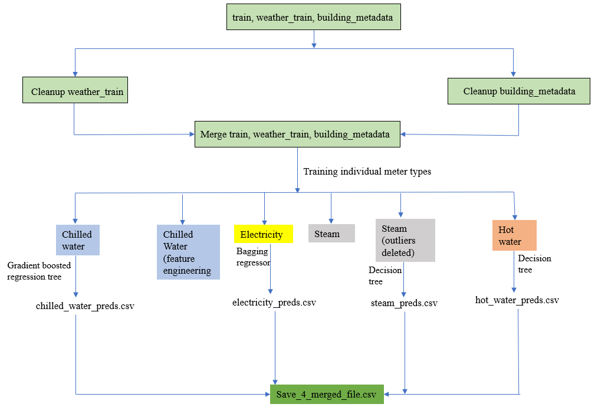
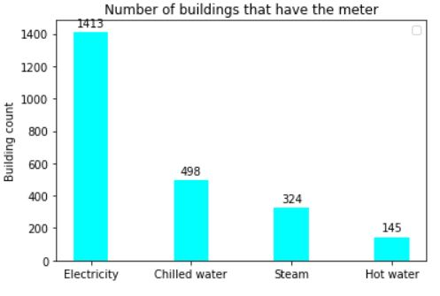
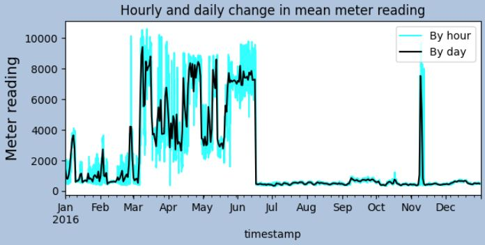

# Thesis-on-ASHRAE-dataset: Project Overview
* Created a tool that would help engineers from American Society of Heating, Refrigeration and Air-conditioning Engineers (ASHRAE) determine what energy saving technology is worth investing in.
* The dataset was provided by ASHRAE and can be found here https://www.kaggle.com/c/ashrae-energy-prediction/data. There were 20 million records for the training set and 40 million records for the test set.
* The flowchart below provides an understanding of the problem.
  * 
* Optimized Linear, Lasso, ridge regression using GridSearchCV to come up with the best performing model, Also made use of Support Vector Regressor, Decision Tree, Ensemble methods, Bagging regressor, gradient boosting. 
* There were 4 meter readings in the dataset. Analysis for each of those meter readings were done separately and then the predictions were merged into one csv file.

# Code and Resources Used

Python packages: pandas, numpy,matplotlib,seaborn, sklearn,

# Features in the dataset

|train        |building_metadata|weather_train     |test       |
|-------------|-----------------|------------------|-----------|                                         
|building_id  | site_id         |site_id           |building_id|                    
|meter        | building_id     |timestamp         |meter      |            
|tmestamp     | primary_use     |air_temperature   |timestamp  |           
|meter reading| square feet     |cloud_coverage    |           |  
|             | year_built      |dew_temperature   |           |
|             | floor_count     |precip_depth_1_hr |           |
|             |                 |sea_level_pressure|           |
|             |                 |wind_direction    |           |
|             |                 |wind_speed        |           |
                                   

# 3. ProcessData cleaning
* Splitting timestamp to create year, month, day in RStudio
* Made use of pandas concat and merged 3 subsets of data (train, building_metadata, weather_train) to create 1 tarinig set and test set (test,building_metadata, weather_test)
* Checked for missing values and filled those accordingly using RStudio, python, excel.

# 4. Analyse EDA
There were 4 types of meters in the dataset. Their counts are shown below-

Analysing EDA it was found that the outliers were coming from building_id 1099 which was being used for education situated in site_id 13 and the meter type was steam.

   
   
# Feature Engineering 
Feature engineering was also attempted to test if the performance improved. But adding information about seasons, beaufort scale did not imrpove the predictions. Lots of outliers were coming from steam portion of the dataset as can be seen in the "ASHRAE data visualization". So, Steam with outliers deleted was also trained to see if the performance improved and it did.  

The individual files are called:
1. ASHRAE Chilled water.ipynb
2. ASHRAE Chilled water (Feature engineering).ipynb
3. ASHRAE Steam.ipynb
4. ASHRAE Steam(deleting outliers).ipynb
5. ASHRAE Electricity.ipynb
6. ASHRAE Hot water.ipynb.

Data loading and data preparation for all the fiels in the list above is the same. But training and test split is different depending on the meter type. Also, the algorithms that were best for predicting meter readings in KWH each of the meter types were different. 

